<div align="center">

```
╔══════════════════════════════════════════════════════════════╗
║   ____             _   _       _   ____        _            ║
║  / ___| _ __   __ _| |_(_) __ _| | |  _ \  __ _| |_ __ _   ║
║  \___ \| '_ \ / _` | __| |/ _` | | | | | |/ _` | __/ _` |  ║
║   ___) | |_) | (_| | |_| | (_| | | | |_| | (_| | || (_| |  ║
║  |____/| .__/ \__,_|\__|_|\__,_|_| |____/ \__,_|\__\__,_|  ║
║        |_|   Analysis with Python                           ║
╚══════════════════════════════════════════════════════════════╝
```

*A hands-on journey through modern geospatial computing — from coordinates to insights*


</div>

---

## 🧭 Learning Path

```mermaid
%%{init: {'theme': 'base', 'themeVariables': {'fontSize': '20px', 'fontFamily': 'monospace'}}}%%
flowchart LR
    M01["📐<br/><br/><b>01 · Basic GIS</b><br/><br/>Read · Write<br/>Visualise"]
    M02["📍<br/><br/><b>02 · Geocoding</b><br/><br/>Address<br/>→ Coordinates"]
    M03["🔍<br/><br/><b>03 · Nearest</b><br/><b>Neighbor</b><br/><br/>BallTree<br/>Haversine"]
    M04["🗺️<br/><br/><b>04 · Catchment</b><br/><b>Area</b><br/><br/>ORS<br/>Isochrones"]
    M05["🏢<br/><br/><b>05 · GWR Data</b><br/><br/>Swiss Building<br/>Register"]
    M06["🛰️<br/><br/><b>06 · Raster</b><br/><b>Data</b><br/><br/>Pixels · Bands<br/>Clip"]
    M07["✍️<br/><br/><b>07 · Tripadvisor</b><br/><b>NLP</b><br/><br/>NER<br/>Heatmaps"]
    M08["⚙️<br/><br/><b>08 · PyQGIS</b><br/><br/>Headless<br/>Choropleth"]

    M01 ==> M02 ==> M03 ==> M04 ==> M05 ==> M06 ==> M07 ==> M08

    linkStyle default stroke:#aaa,stroke-width:3px

    style M01 fill:#1a4a2e,stroke:#4CAF50,stroke-width:2px,color:#fff
    style M02 fill:#1a4a2e,stroke:#4CAF50,stroke-width:2px,color:#fff
    style M03 fill:#1a3a5f,stroke:#2196F3,stroke-width:2px,color:#fff
    style M04 fill:#1a3a5f,stroke:#2196F3,stroke-width:2px,color:#fff
    style M05 fill:#1a3a5f,stroke:#2196F3,stroke-width:2px,color:#fff
    style M06 fill:#3d2a0a,stroke:#FF9800,stroke-width:2px,color:#fff
    style M07 fill:#3d2a0a,stroke:#FF9800,stroke-width:2px,color:#fff
    style M08 fill:#3d0a0a,stroke:#f44336,stroke-width:2px,color:#fff
```



---

## 📋 Module Overview

| # | Module | Key Libraries | What you'll build | Difficulty |
|---|--------|--------------|-------------------|:----------:|
| 01 | **Basic GIS Functionalities** | GeoPandas, Matplotlib, Fiona | Load shapefiles, reproject CRS, plot choropleth maps | ⭐ |
| 02 | **Geocoding Addresses** | GeoAdmin API, GeoPandas, Folium | Batch-geocode a CSV of Swiss addresses to coordinates | ⭐⭐ |
| 03 | **Nearest Neighbor Analysis** | scikit-learn, BallTree, GeoPandas | Find the closest supermarket to every apartment | ⭐⭐ |
| 04 | **Catchment Area Analysis** | OpenRouteService, Folium | Generate drive-time isochrones around retail stores | ⭐⭐⭐ |
| 05 | **GWR Building Data** | Pandas, GeoPandas, SQLAlchemy | Query & visualise Switzerland's full building register | ⭐⭐ |
| 06 | **Raster Data** | Rasterio, NumPy, Matplotlib | Read, clip, and analyse raster grids band by band | ⭐⭐⭐ |
| 07 | **Tripadvisor NLP → Map** | spaCy, Folium, WordCloud | Extract place names from reviews and map them | ⭐⭐⭐ |
| 08 | **QGIS / PyQGIS** | PyQGIS, GADM, QgsProject | Script a styled choropleth map with zero GUI interaction | ⭐⭐⭐⭐ |

---

## 🚀 Quick Start

1. **Fork** this repository
2. Open it in **GitHub Codespaces** — the environment is fully pre-configured

> **Note:** Module 04 requires a free [OpenRouteService API token](https://openrouteservice.org/dev/#/signup). Save it to `04_Python_CatchmentArea_Analysis/ors_token.txt`.

---

## 📚 Modules

### 01 · Basic GIS Functionalities

Covers the fundamental building blocks of GIS in Python: reading/writing spatial formats (GeoJSON, Shapefile, KML), coordinate reference systems (CRS), geometry operations, and static map rendering.

**You'll learn:**
- Loading spatial files with `GeoPandas`
- Reprojecting between CRS (e.g. WGS84 ↔ Swiss LV95)
- Creating choropleth maps with `Leaflet`


---

### 02 · Geocoding Addresses

Geocoding converts human-readable addresses into geographic coordinates (latitude/longitude). This module uses the Swiss **GeoAdmin API** to batch-process address lists and visualise results on an interactive map.

**You'll learn:**
- Calling a GeoAdmin REST geocoding API from Python
- Handling missing/ambiguous geocoding results
- Plotting geocoded points on an interactive `Folium` map


---

### 03 · Nearest Neighbor Analysis

For every apartment, find the closest supermarket — efficiently, at scale.

**You'll learn:**
- Measuring distances between point datasets
- Finding the nearest match for each feature
- Enriching a GeoDataFrame with the results


---

### 04 · Catchment Area Analysis

Uses the **OpenRouteService** routing engine to generate isochrones (drive/walk-time polygons) around locations. Essential for retail site selection, accessibility studies, and urban planning.

**You'll learn:**
- Calling the ORS Isochrones API
- Visualising overlapping catchment zones with Folium
- Comparing walking vs. driving catchments


---

### 05 · GWR Building Data

The **Gebäude- und Wohnungsregister (GWR)** is a federal register of all buildings in Switzerland. This module covers loading, filtering, and visualising this large dataset to extract insights about the built environment.

**You'll learn:**
- Working with large tabular spatial datasets
- Translating German attribute codes (GKAT) to readable labels
- Creating statistical summaries with spatial context

| GKAT Code | Building Category |
|:---------:|------------------|
| 1010 | Residential building (1–2 flats) |
| 1020 | Residential building (3+ flats) |
| 1060 | Commercial / industrial |
| 1080 | Special use |


---

### 06 · Raster Data

Raster data encodes the world as a grid of cells (elevation models, satellite imagery, land-use maps). This module covers reading, clipping, band math, and visualising raster datasets.

**You'll learn:**
- Opening rasters with `rasterio` and inspecting metadata
- Clipping rasters to a vector mask
- Band arithmetic and histogram analysis

```
  Pixel grid (DEM example):
  ┌───┬───┬───┬───┐
  │412│389│401│445│  ← elevation values (meters)
  ├───┼───┼───┼───┤
  │378│355│367│420│
  ├───┼───┼───┼───┤
  │340│312│328│390│
  └───┴───┴───┴───┘
```


---

### 07 · Tripadvisor NLP → Map

Applies **Named Entity Recognition (NER)** to Tripadvisor review text to extract place names, then maps them using GIS tools. Combines NLP and spatial analysis to uncover location patterns hidden in unstructured text.

**You'll learn:**
- Running spaCy NER to extract `GPE` / `LOC` entities
- Geocoding extracted place names
- Building heatmaps and word clouds from spatial mentions


---

### 08 · QGIS / PyQGIS

> ⚠️ **Requires a local QGIS installation to open the generated `.qgz` output file.**

Runs **headless** (no QGIS GUI needed) via the PyQGIS API. A single script downloads Swiss canton boundaries, enriches the features, applies a categorised colour renderer by language region, and saves a ready-to-open `.qgz` project file.

**You'll learn:**
- Running PyQGIS headless (no QGIS Desktop required to execute)
- Loading and enriching vector layers programmatically
- Applying a categorised renderer and saving a `.qgz` project

```
  Language regions of Switzerland
  ────────────────────────────────
  🟦  German          (17 cantons)
  🟥  French/Romandy  ( 4 cantons)
  🟩  Italian/Ticino  ( 1 canton )
  🟪  Bilingual DE/FR ( 3 cantons)
  🟧  DE/RM/IT mix    ( 1 canton )
```


---

<div align="center">

**Built for the classroom · Open source · Pull requests welcome**

</div>
